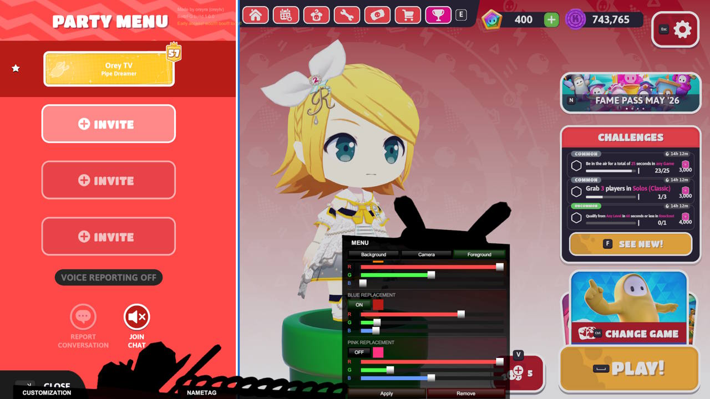



# BettrFG Releases

This repo holds the installer for BettrFG, the Fall Guys mod that aims to make the Fall Guys experience more fun using custom QoL features and UGC customization

### Discord server:
http://dsc.gg/bettrfg

# Features
- Custom UGC skins and accessories
- Nametag customization
- Custom phrases and image emoticons
- Game appearance customization (menu, lobby)
- Personal Best saving and listing
- Custom discovery map played counter

# Skin creation
- Proper guide TBD but you can refer to this as of now https://www.youtube.com/watch?v=mH6U-pOgtco
- [Download base rig.blend](https://github.com/oreytv/BettrFG/raw/refs/heads/main/assets/base%20rig.blend)

# Contribution

Programming, most implementations:
- oreytv (oreyre)

UI:
- oreytv (oreyre)

Audio:
- Persona 5 UI sfx

##### This is really worth noting: AI was heavily used throughout most of the process of creating this mod

# Controls
- Press Shift Z to toggle tabs
- Press Z to toggle side-wheel (and unlock game cursor if stuck)
- Right click the top of a tab while it has a white hover tint to open up a list of tabs to switch to. 

